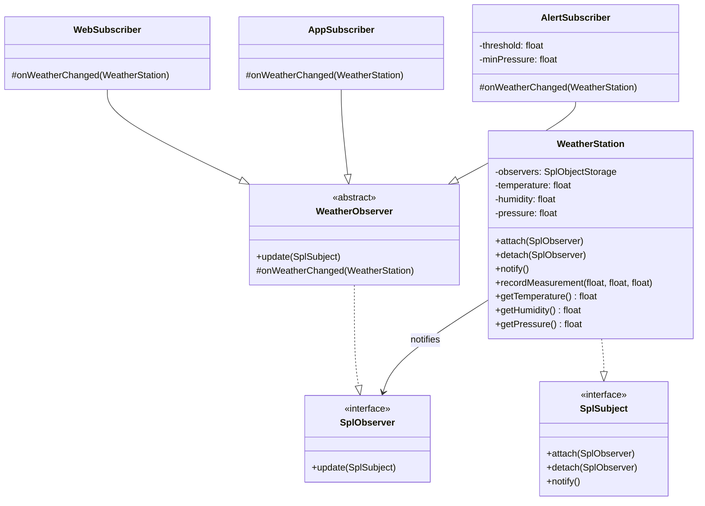

# Observer

> **The Observer Pattern** is a behavioral design pattern where
> multiple objects (**Observers**) subscribe to a central
> object (**Subject**). Whenever that object's state changes,
> it sends notifications to all subscribed objects so they can react accordingly.

---

## Structure

| Role | Example | Responsibility |
|------|---------|----------------|
| **Subject** | `WeatherStation` | Central object that notifies **Observers** on state change |
| **Abstract Observer** | `WeatherObserver` | Base class that type-checks the subject before delegating to concrete observers |
| **Observer** | `WebSubscriber`, `AppSubscriber`, `AlertSubscriber` | Receives updates from the **WeatherStation** |

---

## Steps

1. Create Observer interface
2. Create Abstract Observer
3. Create Concrete Observers
4. Create Concrete Subject



> The **subject** (`WeatherStation`) maintains a list of **observers** (`WebSubscriber`, `AppSubscriber`, `AlertSubscriber`)
> and notifies them automatically whenever its state changes, without knowing anything about their implementations.

---

## Real-World Example

> For a more detailed real-world example, see the **WeatherStation** implementation below.

> The WeatherObserver follows the **Template Method** design pattern.
> This avoids repeating validation logic and provides a strongly typed `WeatherStation`
> to concrete observers.

> In PHP, we can use the **SPL library** that provides the `SplSubject` and `SplObserver` interfaces
> to implement the Observer design pattern.

---

### WeatherStation
=== "Weather Station"

    ```php title="AppSubscriber.php"
    --8<-- "Behavioural/Observer/WeatherStation/WeatherStation.php"
    ```

=== "Weather Observer"

    ```php title="AppSubscriber.php"
    --8<-- "Behavioural/Observer/WeatherStation/Observers/WeatherObserver.php"
    ```

=== "App Subscriber"

    ```php title="AppSubscriber.php"
    --8<-- "Behavioural/Observer/WeatherStation/Observers/AppSubscriber.php"
    ```

=== "Web Subscriber"

    ```php title="WebSubscriber.php"
    --8<-- "Behavioural/Observer/WeatherStation/Observers/WebSubscriber.php"
    ```

=== "Alert Subscriber"

    ```php title="AlertSubscriber.php"
    --8<-- "Behavioural/Observer/WeatherStation/Observers/AlertSubscriber.php"
    ```

###  Tests

```php title="WeatherStationTest.php"
--8<-- "Behavioural/Observer/WeatherStation/WeatherStationTest.php"
```