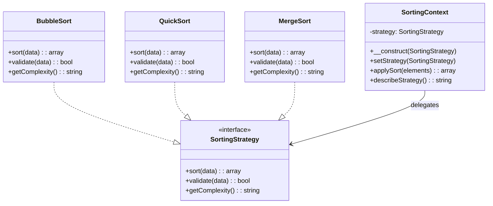

## Structure

| Role | Example | Responsibility |
|------|---------|----------------|
| **Context** | `SortingContext` | Maintains a reference to a **Strategy** and delegates execution to it |
| **Strategy** | `SortingStrategy` | The interface defining the contract all concrete strategies must fulfil |
| **Concrete Strategy** | `BubbleSort`, `QuickSort`, `MergeSort` | Implements a specific algorithm variant |

---

## Steps

1. Create the **Strategy interface**
2. Implement **Concrete Strategies**
3. Create the **Context** class
4. Inject or change the strategy at runtime



> The **context** (like `SortingContext`) delegates the work to whichever **strategy** (like `BubbleSort`, `QuickSort`, `MergeSort`)
> is injected, allowing the algorithm to be swapped at runtime without modifying the context.

---

## Example: Sorting Algorithms

### Strategy Interface

```php title="SortingStrategy.php"
--8<-- "Behavioural/Strategy/Sorting/Strategy/SortingStrategy.php"
```

### Context

```php title="SortingContext.php"
--8<-- "Behavioural/Strategy/Sorting/SortingContext.php"
```

### Strategies

=== "Bubble Sort"

    ```php title="BubbleSort.php"
    --8<-- "Behavioural/Strategy/Sorting/Strategy/BubbleSort.php"
    ```

=== "Quick Sort"

    ```php title="QuickSort.php"
    --8<-- "Behavioural/Strategy/Sorting/Strategy/QuickSort.php"
    ```

=== "Merge Sort"

    ```php title="MergeSort.php"
    --8<-- "Behavioural/Strategy/Sorting/Strategy/MergeSort.php"
    ```

###  Tests

```php title="SortingTest.php"
--8<-- "Behavioural/Strategy/Sorting/SortingTest.php"
```