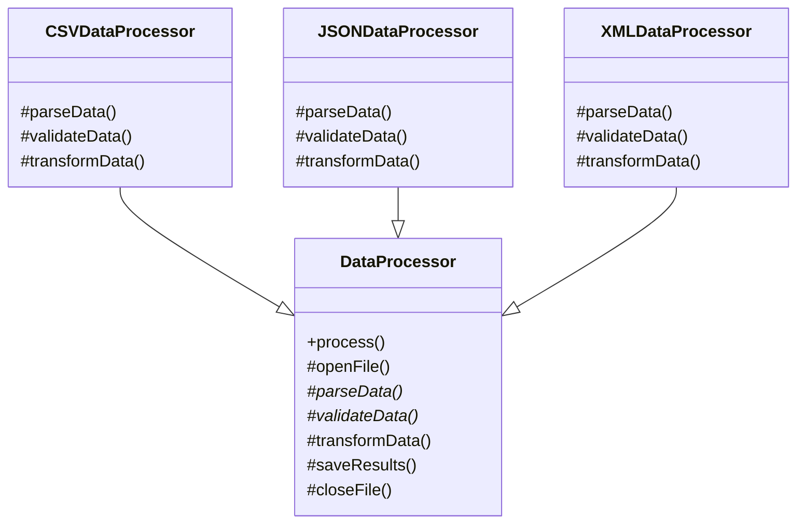

# Template Method

> **The Template Method Pattern** is a behavioral design pattern where
> a base class (**Abstract Class**) defines the **skeleton of an algorithm**,
> while allowing subclasses (**Concrete Classes**) to override specific steps
> without changing the overall structure of the algorithm.

---

## Structure

| Role | Example | Responsibility |
|------|---------|----------------|
| **Abstract Class** | `DataProcessor` | Defines the template method and declares abstract steps |
| **Concrete Class** | `CSVDataProcessor`, `JSONDataProcessor`, `XMLDataProcessor` | Implements specific behavior for individual steps |

---

## Steps

1. Create an **Abstract Class**
2. Define the **template method** that describes the algorithm
3. Declare **abstract steps** that subclasses must implement
4. Optionally define **hook methods** that subclasses may override
5. Create **Concrete Classes** that implement these steps



> The `process()` method is declared `final`, ensuring that the algorithm
> always follows the same sequence of steps while allowing subclasses
> to customize individual parts of the workflow.

---

# Example: Data Processor

A `DataProcessor` defines a fixed pipeline:

**open → parse → validate → transform → save → close**

Each subclass implements the steps required to handle a specific file format.
A `DataRecord` Value Object is passed between steps, decoupling them from raw array structures.

---

=== "Abstract Class"
    ```php title="DataProcessor.php"
    --8<-- "Behavioural/TemplateMethod/DataProcessor/DataProcessor.php"
    ```

=== "Value Object"
    ```php title="DataRecord.php"
    --8<-- "Behavioural/TemplateMethod/DataProcessor/DataRecord.php"
    ```

=== "CSV Processor"
    ```php title="CSVDataProcessor.php"
        --8<-- "Behavioural/TemplateMethod/DataProcessor/CSVDataProcessor.php"
    ```

=== "JSON Processor"
    ```php title="JSONDataProcessor.php"
        --8<-- "Behavioural/TemplateMethod/DataProcessor/JSONDataProcessor.php"
    ```

=== "XML Processor"
    ```php title="XMLDataProcessor.php"
        --8<-- "Behavioural/TemplateMethod/DataProcessor/XMLDataProcessor.php"
    ```

### Tests

```php title="DataProcessorTest.php"
--8<-- "Behavioural/TemplateMethod/DataProcessor/DataProcessorTest.php"
```

---

# Example 2: Pizza Preparation

The `Pizza` class defines the preparation process:

**prepare dough → add sauce → add toppings → bake**

The base class controls the preparation order while subclasses customize the **topping step**.


---

## Abstract Class

```php title="Pizza.php"
--8<-- "Behavioural/TemplateMethod/Pizza/Pizza.php"
```

---

## Concrete Pizzas

=== "Cheesy Stuffed Pizza"

    ```php title="CheesyStuffedPizza.php"
    --8<-- "Behavioural/TemplateMethod/Pizza/CheesyStuffedPizza.php"
    ```

=== "Salami Pizza"

    ```php title="SalamiPizza.php"
    --8<-- "Behavioural/TemplateMethod/Pizza/SalamiPizza.php"
    ```

### Tests

```php title="PizzaTest.php"
--8<-- "Behavioural/TemplateMethod/Pizza/PizzaTest.php"
```