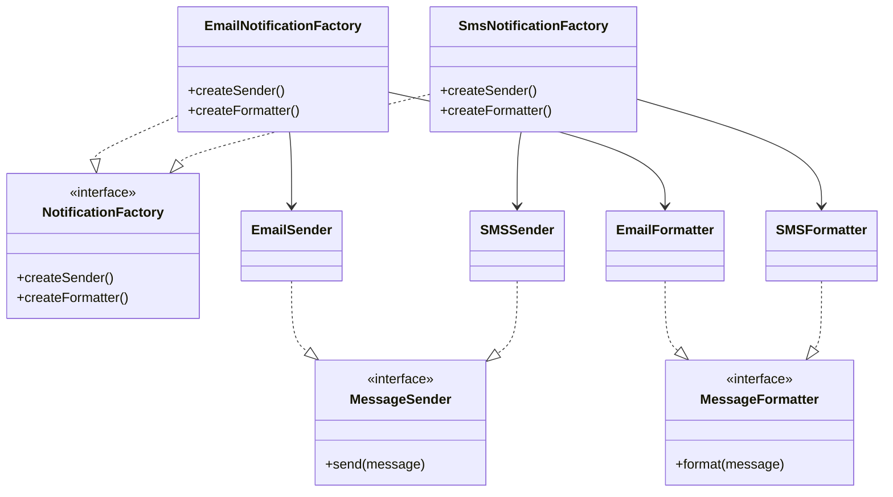

# Abstract Factory

> **The Abstract Factory Pattern** is a creational design pattern that
> provides an interface for creating **families of related or dependent objects**
> without specifying their concrete classes.

It allows a client to create **compatible products** that belong to the same family.

---

## Structure

| Role | Example | Responsibility |
|------|---------|----------------|
| **Abstract Factory** | `NotificationFactory` | Declares methods for creating each product type |
| **Concrete Factory** | `EmailProvider`, `SmsProvider` | Creates a specific family of related products |
| **Abstract Product** | `MessageSender`, `MessageFormatter` | Defines the interface for product types |
| **Concrete Product** | `EmailSender`, `EmailFormatter`, `SMSSender`, `SMSFormatter` | Implements product variants |

---

## Steps

1. Create **Abstract Product interfaces**
2. Create **Concrete Products** that implement these interfaces
3. Create an **Abstract Factory interface**
4. Implement **Concrete Factories** that produce product families



> The client works only with the **factory interface** (like `NotificationFactory`) and **product interfaces** (like `MessageSender`, `MessageFormatter`),
> making it easy to switch entire product families without changing application code.

---

# Example 1: Notification System

`NotificationFactory` creates families of:

**MessageSender + MessageFormatter**

Switching from **Email** to **SMS** delivery requires changing only the factory implementation.

---

## Abstract Factory Interface

```php title="NotificationFactory.php"
--8<-- "Creational/AbstractFactory/Notification/NotificationFactory/NotificationFactory.php"
```

---

## Product Interfaces

=== "Message Sender"

    ```php title="MessageSender.php"
    --8<-- "Creational/AbstractFactory/Notification/MessageSender.php"
    ```

=== "Message Formatter"

    ```php title="MessageFormatter.php"
    --8<-- "Creational/AbstractFactory/Notification/MessageFormatter.php"
    ```

---

## Concrete Factories & Products

=== "Email Provider"

    ```php title="EmailNotificationFactory.php"
    --8<-- "Creational/AbstractFactory/Notification/NotificationFactory/EmailNotificationFactory.php"
    ```

=== "SMS Provider"

    ```php title="SmsNotificationFactory.php"
    --8<-- "Creational/AbstractFactory/Notification/NotificationFactory/SmsNotificationFactory.php"
    ```

### Tests
```php title="NotificationTest.php"
--8<-- "Creational/AbstractFactory/Notification/NotificationTest.php"
```

---

# Example 2: UI Theme System

`ThemeFactory` creates families of UI components:

**Button + Checkbox**

All components produced by one factory are guaranteed to be **visually consistent**.

---

## Abstract Factory Interface

```php title="ThemeFactory.php"
--8<-- "Creational/AbstractFactory/Theme/ThemeFactory/ThemeFactory.php"
```

---

## Product Interfaces

=== "Button"

    ```php title="Button.php"
    --8<-- "Creational/AbstractFactory/Theme/Button.php"
    ```

=== "Checkbox"

    ```php title="Checkbox.php"
    --8<-- "Creational/AbstractFactory/Theme/Checkbox.php"
    ```

---

## Concrete Factories & Products

=== "Dark Theme"

    ```php title="DarkThemeFactory.php"
    --8<-- "Creational/AbstractFactory/Theme/ThemeFactory/DarkThemeFactory.php"
    ```

=== "Light Theme"

    ```php title="LightThemeFactory.php"
    --8<-- "Creational/AbstractFactory/Theme/ThemeFactory/LightThemeFactory.php"
    ```

### Tests
```php title="ThemeTest.php"
--8<-- "Creational/AbstractFactory/Theme/ThemeTest.php"
```
