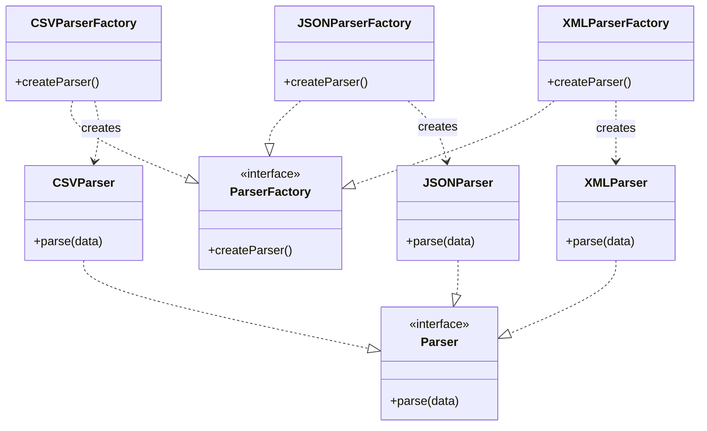

# Factory Method

> **The Factory Method Pattern** is a creational design pattern that
> defines an interface for creating an object but allows subclasses
> to decide **which concrete class to instantiate**.

Instead of instantiating objects directly, the creation logic is delegated
to **factories**, making the system easier to extend without modifying existing code.

---

## Structure

| Role | Example | Responsibility |
|------|---------|----------------|
| **Product** | `Parser` | Defines the interface for objects created by the factory |
| **Concrete Product** | `CSVParser`, `JSONParser`, `XMLParser` | Implements the product interface |
| **Creator** | `ParserFactory` | Declares the factory method |
| **Concrete Creator** | `CSVParserFactory`, `JSONParserFactory`, `XMLParserFactory` | Implements the factory method to create a specific product |

---

## Steps

1. Create a **Product interface**
2. Implement **Concrete Products**
3. Create a **Creator interface** with a factory method
4. Implement **Concrete Creators** that return specific products



> The client interacts only with the **factory interface** (`ParserFactory`) and **product interface** (`Parser`),
> while concrete factories (`CSVParserFactory`) decide which concrete product (`CSVParser`) to instantiate.

---

# Example: Data Parsers

Each concrete factory decides which specific `Parser` implementation to create,
while the client code remains decoupled from the concrete classes.

---

## Product Interface
```php title="Parser.php"
--8<-- "Creational/FactoryMethod/Parser/Parser.php"
```

---

## Creator Interface
```php title="ParserFactory.php"
--8<-- "Creational/FactoryMethod/Parser/ParserFactory/ParserFactory.php"
```

---

## Concrete Creators

=== "CSV Parser Factory"
    ```php title="CSVParserFactory.php"
        --8<-- "Creational/FactoryMethod/Parser/ParserFactory/CSVParserFactory.php"
    ```

=== "JSON Parser Factory"
    ```php title="JSONParserFactory.php"
        --8<-- "Creational/FactoryMethod/Parser/ParserFactory/JSONParserFactory.php"
    ```

=== "XML Parser Factory"
    ```php title="XMLParserFactory.php"
        --8<-- "Creational/FactoryMethod/Parser/ParserFactory/XMLParserFactory.php"
    ```

### Concrete Products

=== "XML Parser"
    ```php title="XMLParser.php"
        --8<-- "Creational/FactoryMethod/Parser/XMLParser.php"
    ```
=== "JSON Parser"
    ```php title="JSONParser.php"
        --8<-- "Creational/FactoryMethod/Parser/JSONParser.php"
    ```
=== "CSV Parser"
    ```php title="CSVParser.php"
        --8<-- "Creational/FactoryMethod/Parser/CSVParser.php"
    ```

### Tests
```php title="ParserTest.php"
--8<-- "Creational/FactoryMethod/Parser/Parser.php"
```
