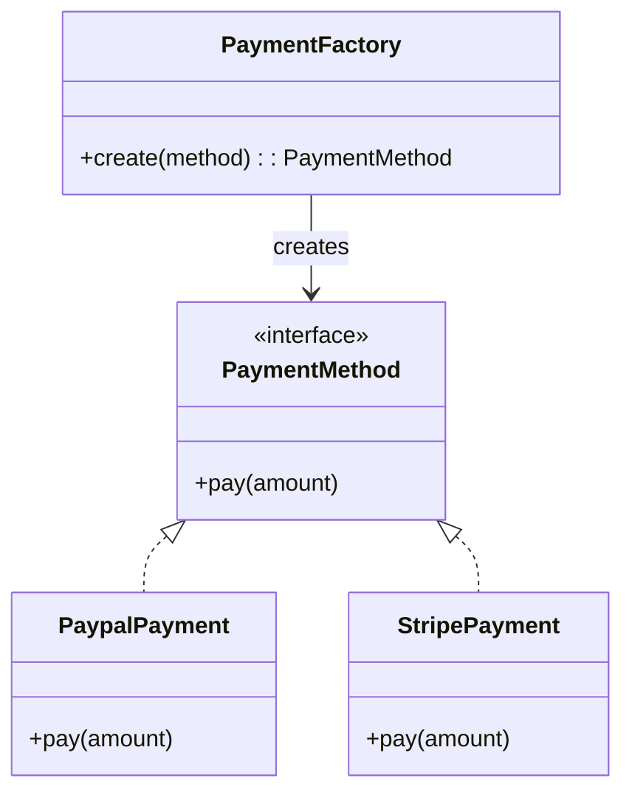

# Simple Factory

> **The Simple Factory Pattern** is a common programming idiom where
> a single factory class is responsible for creating objects based on input parameters.

!!! note "Not a GoF Pattern"
Simple Factory is **not one of the 23 Gang of Four design patterns**.
It is widely used in practice because it **centralizes object creation logic**
and hides the concrete class instantiation from the client.

---

## Structure

| Role | Example | Responsibility |
|------|---------|----------------|
| **Factory** | `PaymentFactory` | Decides which concrete product to create |
| **Product** | `PaymentMethod` | Defines the common interface |
| **Concrete Product** | `PaypalPayment`, `StripePayment` | Implements the product interface |

---

## Steps

1. Create a **Product interface**
2. Implement **Concrete Products**
3. Create a **Factory class**
4. The factory decides which object to create based on input



> The client calls the factory (like `PaymentFactory`) with a parameter (for example `"Paypal"` or `"Stripe"`),
> and the factory decides which **concrete product** (like `Paypal` or `Stripe`) should be instantiated.

---
# Example 1: Payment Factory

`PaymentFactory` creates the appropriate payment gateway
based on a payment method identifier.

---

## Product Interface

```php title="PaymentMethod.php"
--8<-- "Creational/SimpleFactory/Payment/PaymentMethod.php"
```

---

### Factory

```php title="PaymentFactory.php"
--8<-- "Creational/SimpleFactory/Payment/PaymentFactory.php"
```

---

## Concrete Products

=== "PayPal"

    ```php title="PaypalPayment.php"
    --8<-- "Creational/SimpleFactory/Payment/PaypalPayment.php"
    ```

=== "Stripe"

    ```php title="StripePayment.php"
    --8<-- "Creational/SimpleFactory/Payment/StripePayment.php"
    ```

### Tests

```php title="PaymentTest.php"
--8<-- "Creational/SimpleFactory/PaymentTest.php"
```

---

# Example 2: Animal Factory

`AnimalFactory` creates different `Animal` objects based on a given type.

---

## Product Interface

```php title="Animal.php"
--8<-- "Creational/SimpleFactory/Animal/Animal.php"
```

---

## Factory

```php title="AnimalFactory.php"
--8<-- "Creational/SimpleFactory/Animal/AnimalFactory.php"
```

---

## Concrete Products

=== "Dog"
    ```php title="Dog.php"
    --8<-- "Creational/SimpleFactory/Animal/Dog.php"
    ```

=== "Cat"
    ```php title="Cat.php"
    --8<-- "Creational/SimpleFactory/Animal/Cat.php"
    ```

### Tests

```php title="Cat.php"
--8<-- "Creational/SimpleFactory/AnimalTest.php"
```