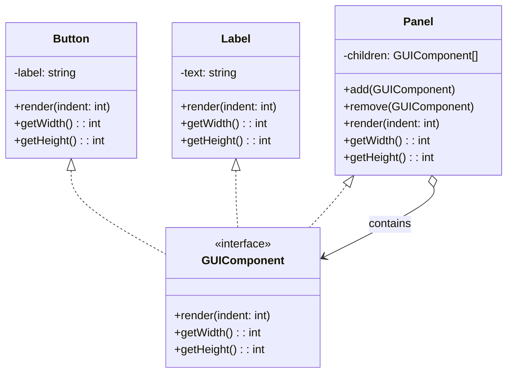

# Composite

> **The Composite Pattern** is a structural design pattern that
> composes objects into **tree structures** to represent **part-whole hierarchies**.
> It allows clients to treat **individual objects (leaves)** and **groups of objects (composites)** uniformly.

---

## Structure

| Role | Example | Responsibility |
|------|---------|----------------|
| **Component** | `GUIComponent` | Declares the common interface for leaves and composites |
| **Leaf** | `Button`, `Label` | Represents end objects with no children |
| **Composite** | `Panel` | Stores child components and delegates operations to them |
| **Client** | Any class | Works with components through the common interface |

---

## Steps

1. Create a **Component interface**
2. Implement **Leaf classes** representing individual objects
3. Implement a **Composite class** that stores child components
4. Allow clients to interact with **all components through the same interface**



> The key idea is that **both individual objects** (like `Button`, `Label`) **and containers** (like `Panel`) **implement the same interface** (like `GUIComponent`),
> allowing the client to treat them uniformly.

---

# Example: GUI Component Tree

A `Panel` can contain:

- `Button`s
- `Label`s
- other `Panel`s

---

## Component Interface

```php title="GUIComponent.php"
--8<-- "Structural/Composite/GUI/GUIComponent.php"
```

---

## Leaves

=== "Button"

    ```php title="Button.php"
    --8<-- "Structural/Composite/GUI/Button.php"
    ```

=== "Label"

    ```php title="Label.php"
    --8<-- "Structural/Composite/GUI/Label.php"
    ```

---

## Composite

```php title="Panel.php"
--8<-- "Structural/Composite/GUI/Panel.php"
```

## Tests


```php title="GUIComponentTest.php"
--8<-- "Structural/Composite/GUI/GUIComponentTest.php"
```